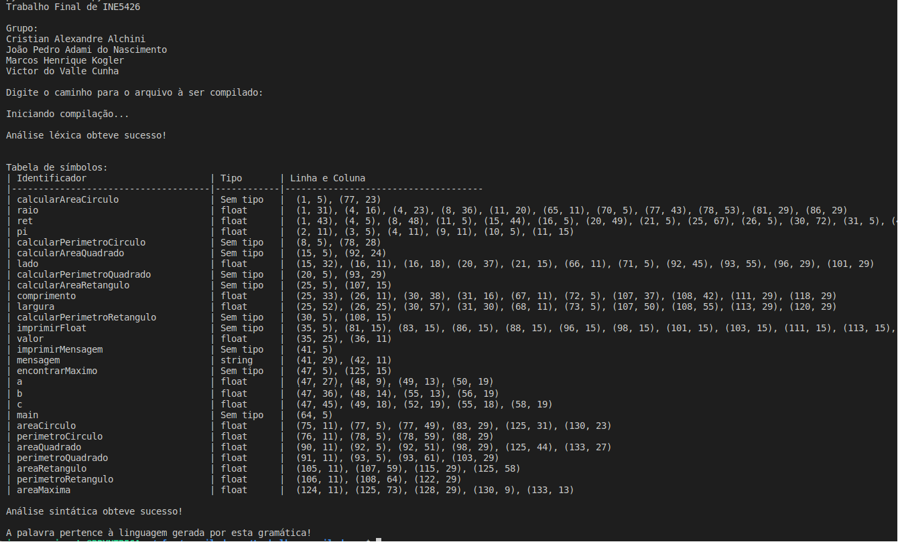

# Construção de um compilador

Trabalho final da disciplina INE5426-06208 (20242) - Construção de Compiladores

Grupo:
- Cristian Alexandre Alchini (20100519)
- Marcos Henrique Kogler (21250087)
- João Pedro Adami do Nascimento (19100531)
- Victor do Valle Cunha (20104135)

As seguintes tarefas foram realizadas:

- Construção de um analisador léxico para a linguagem (AS)
- Construção de um analisador sintático para a linguagem (AS)
- Construção de um analisador semântico (ASem) para inserção do tipo na tabela de símbolos

O gerador de código intermediário não foram implementados

## Execução

Este projeto foi desenvolvido na linguagem Python 3 versão 3.10

Para rodar o projeto, certifique-se de que você possui o Python 3.10 instalado em sua máquina e que o comando `python3.10` existe. Após, isto execute o seguinte comando no diretório raiz do projeto

```
make
```

Caso o comando `python3.10` não esteja disponível na sua máquina, altere a linha 2 do `Makefile` para o executável Python disponível em sua máquina.

## Alterações da gramática CC-2024-2

A seguinte produção da gramática CC-2024-2 foi alterada:

```
FUNCCALL -> ident(PARAMLISTCALL)
```

A alteração foi adicionar um novo símbolo terminal `run` que precede as chamadas de função. Portanto, esta produção tomou a seguinte forma:

```
FUNCCALL -> run ident(PARAMLISTCALL)
```

## Documentação

O diretório `docs/` contém arquivos de documentação do projeto:

- `gramatica.txt`: Gramática ConvCC-2024-2, sem recursão à esquerda, fatorada, e pertencente a classe LL(1)

- `diagramas-transicao.pdf`: Diagramas de transição do analisador léxico

- `dec.pdf`: Contém as definições das SDDs e SDTs utilizadas na análise semântica das produções que derivam declarações de variáveis

## Programas exemplo

O diretório `exemplos/` contem três programas escritos na linguagem ConvCC-2024-2 com pelo menos 100 linhas cada, sem erros léxicos, sem erros sintáticos e sem erros semânticos, conforme requisitado no enunciado do trabalho.

## Saída

Exemplo de saída esperada para o programa:

